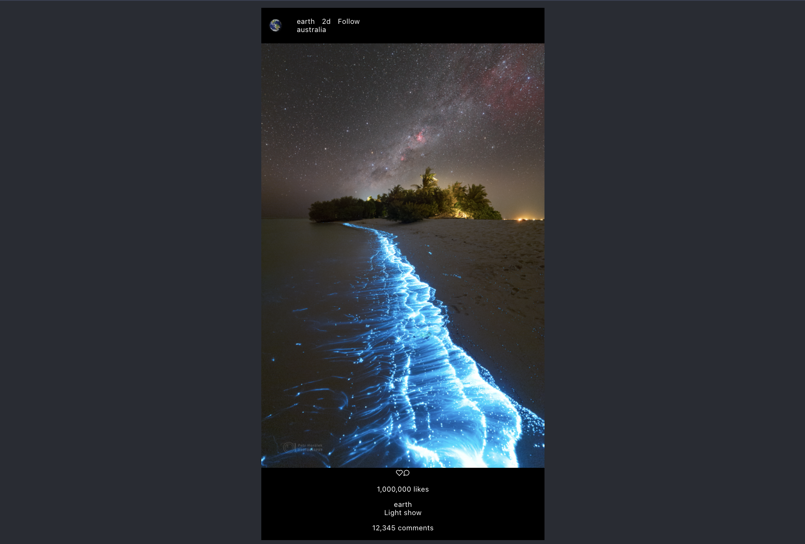

### PLANNING Sun Jul 2

I'm finally starting this!!!

Here was a [SUPER quick Typescript/React refresher](https://www.youtube.com/watch?v=ydkQlJhodio)

**current road map in my head is**
1.   hard code instagram homepage design.
- addendum: this includes basic responsive features like liking a picture, likes increasing.... i don't know how this is gonna work later with having different multiple users but ill figure it out i think.... maybe i should postpone this idk darn
2.  then have it able to accept props.
3.  then hook it up to a DB ?? (i say this like i know what I'm talking about... I dont) so that the front page is responsive.
4.  hard code user pages/ feeds
5.  have it accept props + the DB will already be connected ? so just integrate
6.  ummm i think maybe here we should split by having a login for different users. **maybe i should set up a dummy login page FIRST** so that there can at least be different users... this seems like abetter idea actually. ok so we'll make the login page real this time where there has to be UQ usernames and passwords in the DB

Hard code instagram web app design. Brain dump

- [ ] post **component**. 
    - [ ] user (name and PFP)
    - [ ] photo
    - [ ] caption 
    - [ ] heart/like
    - [ ] time (relative)
    - [ ] comment **component**
        - [ ] user
        - [ ] comment 
        - [ ] time (relative)
    - [ ] share button/bookmark which i dont care about.
- [ ] story **component** -- I'm gonna delay this, gonna focus on post layout 
    - [ ] user (PFP)
    - [ ] have/nt seen ring 
    - [ ] clickabilty to  OPEN
    - [ ] once OPEN clickability to see the next story
    - [ ] once OPEN clickability to see next user (also show preview of next user)
    - [ ] once OPEN clickability to close 
- [ ] user profile in top right
    - [ ] ability to log out 
    - [ ] ability to go to profile feed
- [ ] profile feed **component**
    - [ ] # posts
    - [ ] # followers 
    - [ ] # following
    - [ ] ability to un/follow
    - [ ] ability to switch to post feed (same as _post compoent_ above)
    - [ ] square feed 
    - [ ] save stories (shoudl be same as _story compoent_ above)

_aside:_ I think for now, I'm just gonna accept the fact this is probably gonna look like shit on mobile. that _might_ be a later problem

_aside:_ i dont think ive ever realized that the online instagram app kinda sucks ass... i think i shall take elements of the app and

_aside:_ if anyone ever reads this im actually incapable of spelling. there is spell check but i do not care enough to change each word i spelled wrong. I'm doing my best

---

### START! Sun Jul 2

unfortunatlry i leave on a trip jul 3 and will not be bringing my laptop. it was as good as ever to start a project now rather than later tho! (me forcing myself to think positive 🫡 )

alrighty starting with post!

Im gonna say these are the sections user/post info, post, post interaction buttons, # likes, caption, comment section. 

I'm noticing that the web app doesnt show any comments even if there are many where the mobile version i knowusally shows a max of three when idly scrolling just the # of comments. 

Both the 'more' button and actual comment button completly open up the post where there is still only a preview of the comments (doesnt render ALL of them) you can scroll to render more

aside: damn amazon has some ANNOYINGly long links for image uploads

> What is the convention for React .css files do you just have one? App.ccs or multiple for each compoennt? 

- Gonna have multiple for now but gotta answer this at some point

> What is .css standard number size? is it em? WHat should I use

- Using vmin for now since is was in the App.css

 I'm sitting here realizing i liked React Native better eceaus eyou could have multiple style references. I could also achieve this with styled componets I think. wonder if i should o that?

 ✅ alright im wrapping up for the night (its 4am so i might still work on it later) today but the post is looking ok. 

 
 
 🆘 I absolutley HATE the structure of my CSS and wish there was somthign I coudl do to minimize my code.  

 Somethings I'm noticing: 
 - there should be border-radius around the image and the post itself. its really small but is actually noticable
 - i forgot the little dot seperators between the header info text
